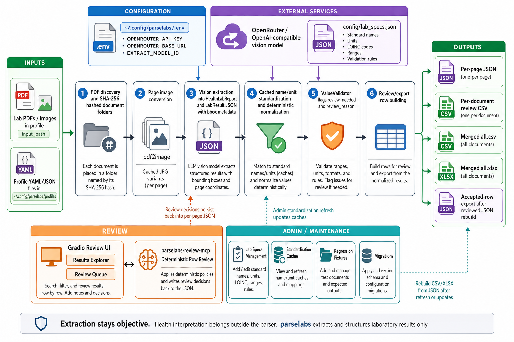

<div align="center">
  

  <h1>parselabs</h1>

  **🔬 Extract lab results from medical PDFs with vision extraction and reviewed JSON fixtures 📊**
</div>

parselabs is a Python CLI for turning lab-report PDFs and images into structured review data. It converts pages to images, extracts objective lab results with an OpenRouter-compatible vision model, standardizes names and units, validates suspicious values, and writes CSV/XLSX outputs.

The parser keeps extraction objective. Review decisions, fixture promotion, and health interpretation happen outside the extraction model through the review UI, MCP review server, and admin tooling.

## Install

Requirements:

- Python 3.10+
- [uv](https://docs.astral.sh/uv/)
- Poppler for PDF conversion

```bash
git clone https://github.com/tsilva/parselabs.git
cd parselabs
uv tool install . --editable
```

On macOS, install Poppler with:

```bash
brew install poppler
```

Create shared runtime settings:

```bash
mkdir -p ~/.config/parselabs/profiles

cat > ~/.config/parselabs/.env <<'EOF'
OPENROUTER_API_KEY=your_key_here
# Optional:
# OPENROUTER_BASE_URL=https://openrouter.ai/api/v1
EXTRACT_MODEL_ID=google/gemini-2.5-pro
EOF
```

Create a profile:

```bash
cat > ~/.config/parselabs/profiles/myname.yaml <<'EOF'
name: "My Labs"
paths:
  input_path: "/path/to/lab/pdfs"
  output_path: "/path/to/output"
  input_file_regex: "*.pdf"

processing:
  workers: 4
EOF
```

Run extraction:

```bash
parselabs --profile myname
```

Open the review workspace with:

```bash
parselabs review --profile myname
parselabs review --profile myname --tab review
```

## Commands

```bash
parselabs                                  # run extraction for all profiles
parselabs --profile myname                 # run one profile
parselabs extract --profile myname         # explicit extraction command
parselabs --list-profiles                  # list configured profiles
parselabs --profile myname --model MODEL   # override extraction model
parselabs --profile myname --pattern "*.pdf"
parselabs --profile myname --rebuild-from-json

parselabs review --profile myname          # launch Results Explorer on port 7862
parselabs review --profile myname --tab review
parselabs-review-mcp                       # deterministic row review MCP server

parselabs admin --help
parselabs admin validate-lab-specs
parselabs admin update-standardization-caches --profile myname
parselabs admin regression sync-reviewed --profile myname

uv run python test.py --profile myname     # data integrity checks for one profile
uv run python test.py                      # data integrity checks for all profiles
RUN_APPROVED_DOCS=1 uv run pytest -m approved_docs
```

## Notes

- Profiles live in `~/.config/parselabs/profiles/` as YAML or JSON. Shared runtime settings live in `~/.config/parselabs/.env`; shell environment variables take precedence.
- `OPENROUTER_API_KEY` and `EXTRACT_MODEL_ID` are required for extraction. `OPENROUTER_BASE_URL` defaults to `https://openrouter.ai/api/v1`.
- Each processed PDF gets a hashed output directory containing the copied source PDF, cached page JPGs, per-page JSON, and a per-document review CSV.
- Page JSON is the durable source of truth. Per-document CSVs, `all.csv`, and `all.xlsx` are rebuilt from JSON and review state.
- Review UI defaults to the Results Explorer on `http://127.0.0.1:7862`; `--tab review` launches the Review Queue on `http://127.0.0.1:7863`.
- `config/lab_specs.json` contains standardized lab names, primary units, conversion factors, LOINC codes, reference ranges, and validation rules.
- `parselabs admin` is the preferred entry point for maintenance, lab-spec validation, cache refreshes, reviewed fixture sync, and output migrations.

## Architecture



For a step-by-step description of the current extraction, review, and export pipeline, see [docs/pipeline.md](docs/pipeline.md).

## License

[MIT](LICENSE)
